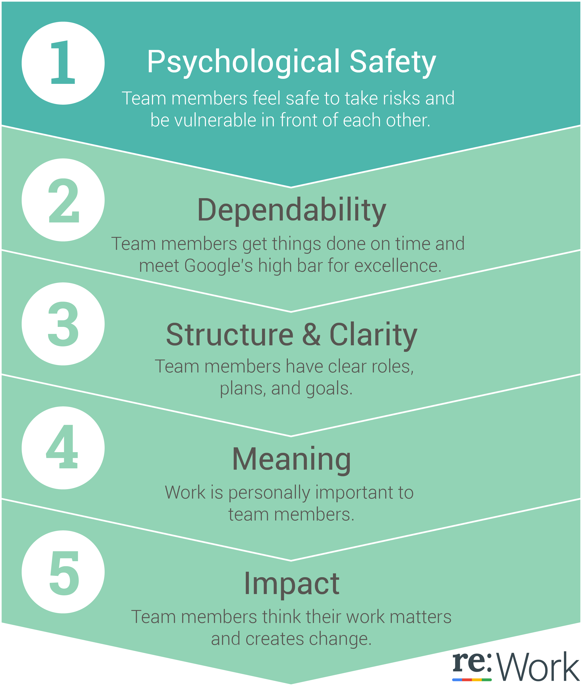

### Build Successful Team

#### Define what makes a “team”

- Work groups are characterized by the least amount of interdependence. They are based on organizational or managerial hierarchy. Work groups may meet periodically to hear and share information.

- Teams are highly interdependent - they plan work, solve problems, make decisions, and review progress in service of a specific project. Team members need one another to get work done.

#### Define “effectiveness”

So the researchers measured team effectiveness in four different ways:

- Executive evaluation of the team

- Team leader evaluation of the team

- Team member evaluation of the team

- Sales performance against quarterly quota

#### Identify dynamics of effective teams

We learned that there are five key dynamics that set successful teams apart from other teams at Google:

##### Psychological​ ​Safety  

Signs ​that ​your ​team ​needs ​to ​improve ​psychological ​safety:

- Fear ​of ​asking ​for ​or ​giving ​constructive ​feedback

- Hesitance ​around ​expressing ​divergent ​ideas ​and ​asking ​“silly” ​questions
​
Questions ​to ​ask ​yourself:

- Do ​all ​team ​members ​feel ​comfortable ​brainstorming ​in ​front ​of ​each ​other?

- Do ​all ​team ​members ​feel ​they ​can ​fail ​openly, ​or ​will ​they ​feel ​shunned?

> Alphabet's Astro Teller describes the "pre-mortem," an exercise used by organizations to identify possible pitfalls it may encounter. Teams imagine in great detail that a project has launched and then predict what could go wrong. Depending on the likelihood and seriousness of the problem, the organization can take proactive steps to prevent it from happening.

[http://ecorner-legacy.stanford.edu/videos/4212/Predict-Failures-Before-Beginning](http://ecorner-legacy.stanford.edu/videos/4212/Predict-Failures-Before-Beginning)

##### Dependability   

Signs ​that ​your ​team ​needs ​to ​improve ​dependability:

- Team ​has ​poor ​visibility ​into ​project ​priorities ​or ​progress

- Diffusion ​of ​responsibility ​and ​no ​clear ​owners ​for ​tasks ​or ​problems

Questions ​to ​ask ​yourself:

- When ​team ​members ​say ​they'll ​get ​something ​done, ​do ​they?

- Do ​team ​members ​proactively ​communicate ​with ​each ​other ​about ​delays ​and ​assume responsibility?

##### Structure​ ​and​ ​Clarity 

Signs ​that ​your ​team ​needs ​to ​improve ​structure ​and ​clarity:

- Lack ​of ​clarity ​about ​who ​is ​responsible ​for ​what

- Unclear ​decision-making ​process, ​owners, ​or ​rationale

Questions ​to ​ask ​yourself:

- Do ​team ​members ​know ​what ​the ​team ​and ​project ​goals ​are ​and ​how ​to ​get ​there?

- Do ​team ​members ​feel ​like ​they ​have ​autonomy, ​ownership, ​and ​discrete ​projects?

##### Meaning 
​
Signs ​that ​your ​team ​needs ​to ​improve ​meaning:

- Work ​assignments ​based ​solely ​on ​ability, ​expertise, ​workload; ​little ​consideration ​for individual ​development ​needs ​and ​interests

- Lack ​of ​regular ​recognition ​for ​achievements ​or ​milestones

Questions ​to ​ask ​yourself:

- Does ​the ​work ​give ​team ​members ​a ​sense ​of ​personal ​and ​professional ​fulfillment?

- Is ​work ​matched ​to ​team ​members ​based ​on ​both ​skills/ability ​and ​interest?

##### Impact

Signs ​that ​your ​team ​needs ​to ​improve ​impact:

- Framing ​work ​as ​“treading ​water”

- Too ​many ​goals, ​limiting ​ability ​to ​make ​meaningful ​progress

Questions ​to ​ask ​yourself:

- Do ​team ​members ​see ​their ​work ​as ​creating ​change ​for ​the ​better?

- Do ​team ​members ​feel ​their ​work ​matters ​for ​a ​higher-order ​goal?

- How ​are ​current ​team ​processes ​affecting ​well-being/burnout?

### Resource

- [https://www.youtube.com/watch?v=KZlSq_Hf08M](https://www.youtube.com/watch?v=KZlSq_Hf08M)

- [https://www.youtube.com/watch?v=LhoLuui9gX8](https://www.youtube.com/watch?v=LhoLuui9gX8)

- [https://rework.withgoogle.com/blog/five-keys-to-a-successful-google-team/](https://rework.withgoogle.com/blog/five-keys-to-a-successful-google-team/)

- [https://rework.withgoogle.com/guides/understanding-team-effectiveness/steps/define-team/](https://rework.withgoogle.com/guides/understanding-team-effectiveness/steps/define-team/)
